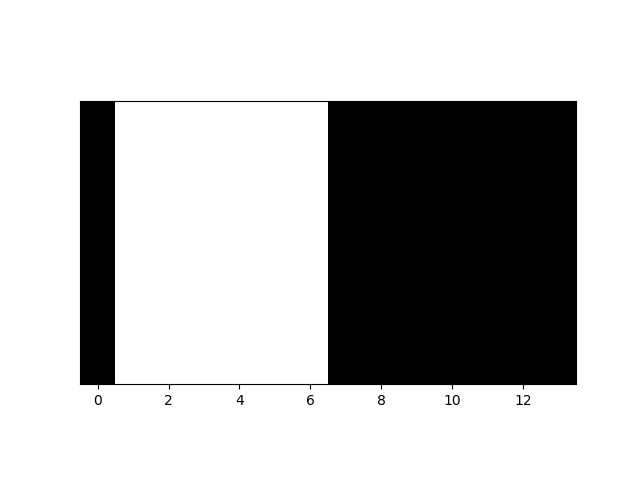

[](
  https://circleci.com/gh/dwave-examples/paint-shop-optimization)

# Multi-Car Paint Shop Optimization

In car manufacturing, one step of production is painting
the car body before assembly. A queue of cars enter the paint shop, undergo
the painting procedure, and exit the paint shop. For all practical purposes, 
the sequence of cars entering the paint shop is assumed to be fixed. 
However, the colors assigned to the cars within a given sequence can be optimized.

In this problem, the sequence of cars queued for painting consists one or more 
ensembles, which might represent various car models or orders from different 
customers, for example. Some cars of each ensemble are to be painted black and 
the remainder white. The goal of the optimization is to minimize the number of 
color switches between cars in a paint shop queue, since there is a cost and 
waste associated with switching paint. This problem is known to be NP-hard. 
We demonstrate how to formulate this problem using the constrained quadratic 
model (CQM) class.

The problem instances used in this example are generated randomly. You can generate 
your own instances by following the format of the example in `data/exp.yml`, which 
is taken from the paper by Yarkoni et. al (see Ref [[1]](#1)).


The formulation of this optimization problem can be summarized as:
1) Objective: Minimize the number of color changes
2) Constraint: Ensure that the correct number of cars are painted white/black


This is an example for the generalization of the binary paint shop optimization outlined 
by Volkswagen team in the paper Ref [[1]](#1). 

## Usage

To run a small demo, run the command:

```bash
python car_paint_shop.py --filename data/exp.yml
```

`data/exp.yml` is a small data set that includes a sequence of cars 
under `sequence` and the number of cars to be painted black 
for each car ensemble under `counts`. 

To run the demo on a random instance, run the command:

```bash
python car_paint_shop.py --num-cars 10
```

You can configure a seed, and a few other parameters to generate your desired
random problem. For the full list of parameters please see the docstring of the
`main` function in `car_paint_shop.py`. 


## Output
The script `car_paint_shop.py` creates and solves an optimization problem given an input file 
or given parameters of a random problem. After creating the optimization problem, it 
sends it to the CQM solver (`LeapHybridCQMSampler`). The output of the sampler is 
processed and the three best feasible solutions are printed. The objective function 
and the number of color switches are printed. Note that there is a parameter `mode` that 
you can pass that determines the objective function. If you set `--mode 1`, 
the objective function is the same as the function that computes the number of switches. 
In Ref [[1]](#1), the authors used two different functions; one as the objective and 
one as the number of switches. After the script is complete, you'll 
also find an image for each of the solutions. The image contains a strip of white or 
black for each car stacked together horizontally.

The images will be saved in the `images` folder.


The image above shows one optimal solution, where the first four cars (indexed at 0 to 3) and the last 
four cars (indexed at 10 to 13) are painted black and the rest are painted white. 
This solution has two color switches. The image below shows another optimal solution with two color switches.




## Formulation
### Objective
Suppose that we have `N` cars in a sequence. Each car can be painted black or 
white. The goal of the optimization is to reduce the number of times the color 
switches since there is a cost and waste associated with switching paint.

The authors of Ref [[1]](#1) work with spin variables that take values -1 
for white paint and +1 for black paint. This example uses binary variables with 
values 0 for white paint and 1 for black paint. A spin 
variable `s` can be converted to a binary variable `x` as follows (for reference 
see Ref [[2]](#2)).


We can optimize the number of color switches by counting the number of times 
the binary value of adjacent cars changes.


Alternatively, we can reduce the number of color changes by minimizing a function 
that rewards (assigns negative values to) assigning the same color to adjacent cars. 
This function can easily be expressed in terms of spin variables. When two consecutive 
cars have the same color, the product of their values is positive; if the colors are 
different, the product is negative.


Equivalently, the equation above can be written with binary variables as:


The following equality shows the equivalence of these two formulations:


### Constraints
The sequence of `N` cars has `M` unique car ensembles (`M < N`). For each car 
ensemble (`C_j`) we want to make sure that the correct number of the cars in 
the ensemble (`N_j`) are painted black (and the remaining ones are painted white). 

The equation below represents the constraint that the sum over the binary 
variables `x_i` representing cars of ensemble `C_j` should equal the number of cars 
that should be painted black (`N_j`).


## Code

The CQM class enables native formulation of objective and constraints using symbolic math.

Let's define `x` as the list of binary variables `x[0] = dimod.Binary(0)` to 
`x[9] = dimod.Binary(9)` for 10 cars in a sequence. We can compute the number 
of color changes by looking at the difference between adjacent cars. For example, 
`x1-x0` gives us the difference of `+1` or `-1` or `0`. Since only the value 
of `0` is desired, we can optimize the square of the difference. The objective 
function is

```python
import dimod
x = list(dimod.Binaries(range(10)))
objective = 0
for i in range(9):
    objective += (x[i + 1] - x[i]) ** 2

cqm = dimod.ConstrainedQuadraticModel()
cqm.set_objective(objective)

# Assume there is only one unique car ensemble. For this single car ensemble, we 
# want to paint 5 of them black.

count = dimod.quicksum(x)
cqm.add_constraint(count == 5)
```

Note that the operators `-` and `**` can be used with variables `x`, which are 
binary quadratic models. We can then add this objective to a CQM object.

Similarly, you can see that the code above adds an equality constraint (the sum 
of binary variables `x` is equal to 5) by defining a quadratic model (`count`, a 
quadratic model created by summing a list of binary quadratic models, `x`) and 
setting it to the target value.


## References

<a name="1">[1]</a> Yarkoni et. al. Multi-car paint shop optimization with quantum annealing, 
[arxiv](https://arxiv.org/pdf/2109.07876.pdf)

<a name="2">[2]</a> https://docs.dwavesys.com/docs/latest/c_gs_9.html#transformations-between-ising-and-qubo

## License

Released under the Apache License 2.0. See [LICENSE](LICENSE) file.
